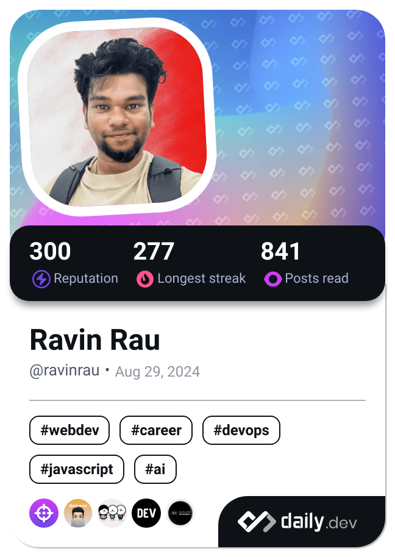

<h1 align="center">Hi 👋, I'm Ravin Rau</h1>
<h3 align="center">Love frontend and animating websites...</h3>

<h4 align="center">Connect with me:</h4>

  
  
  
  
  

---

| | |
| :---: | :---: |

 

